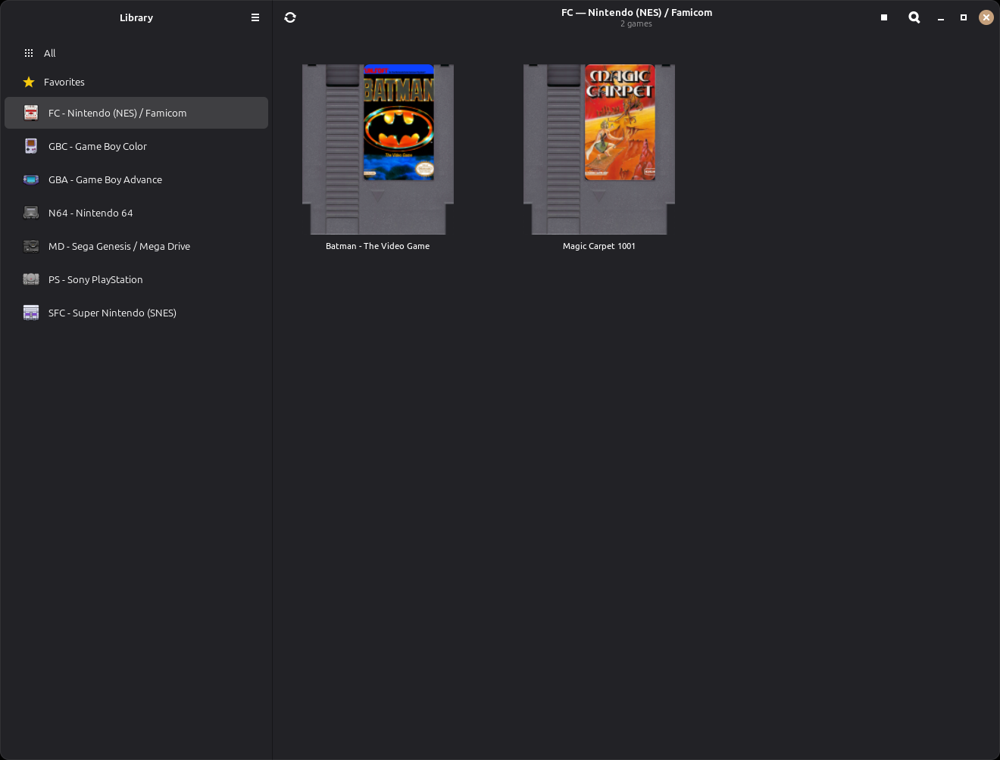
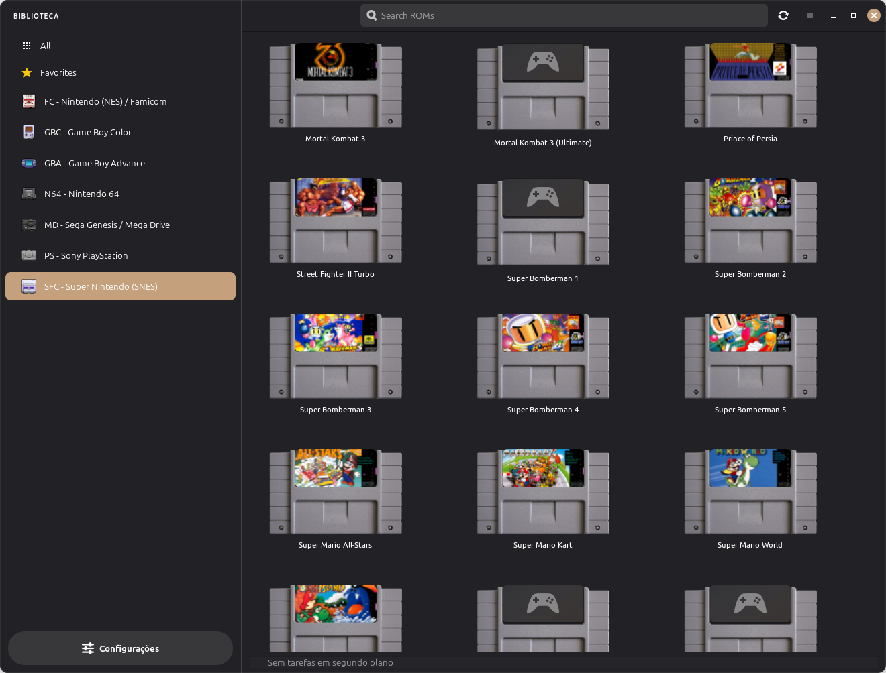
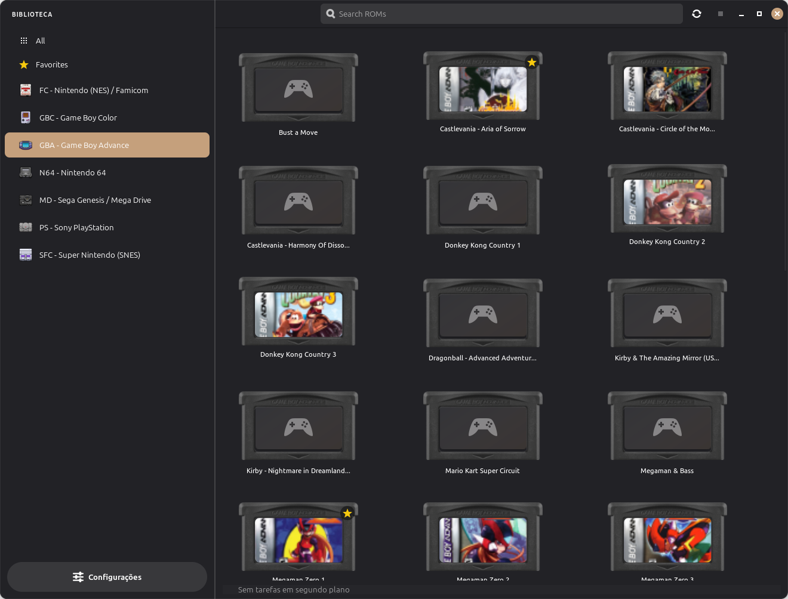
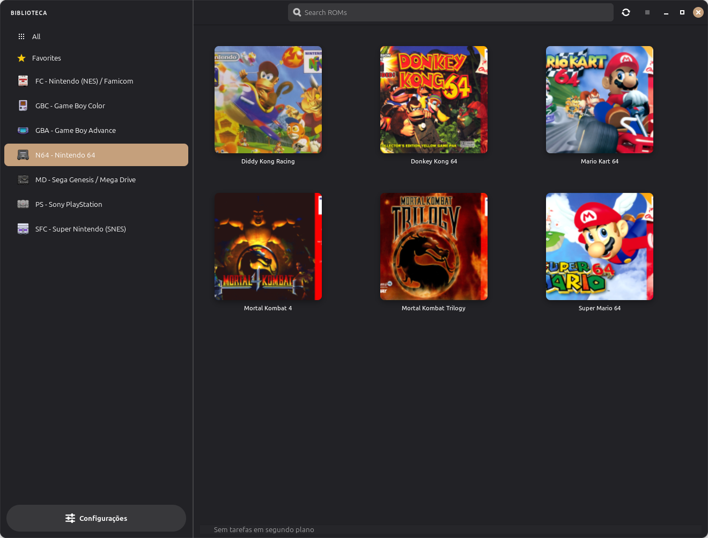
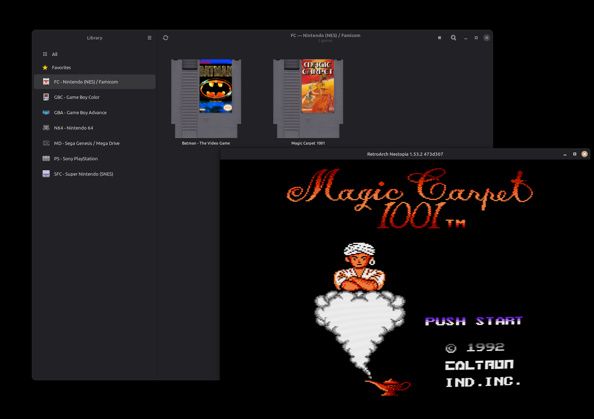
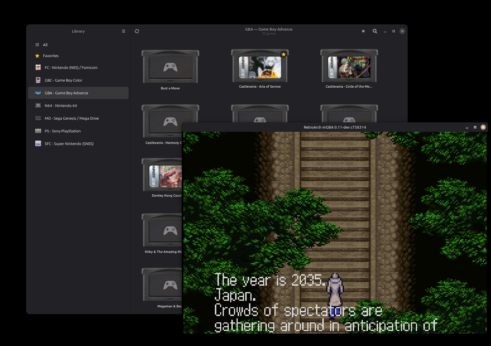
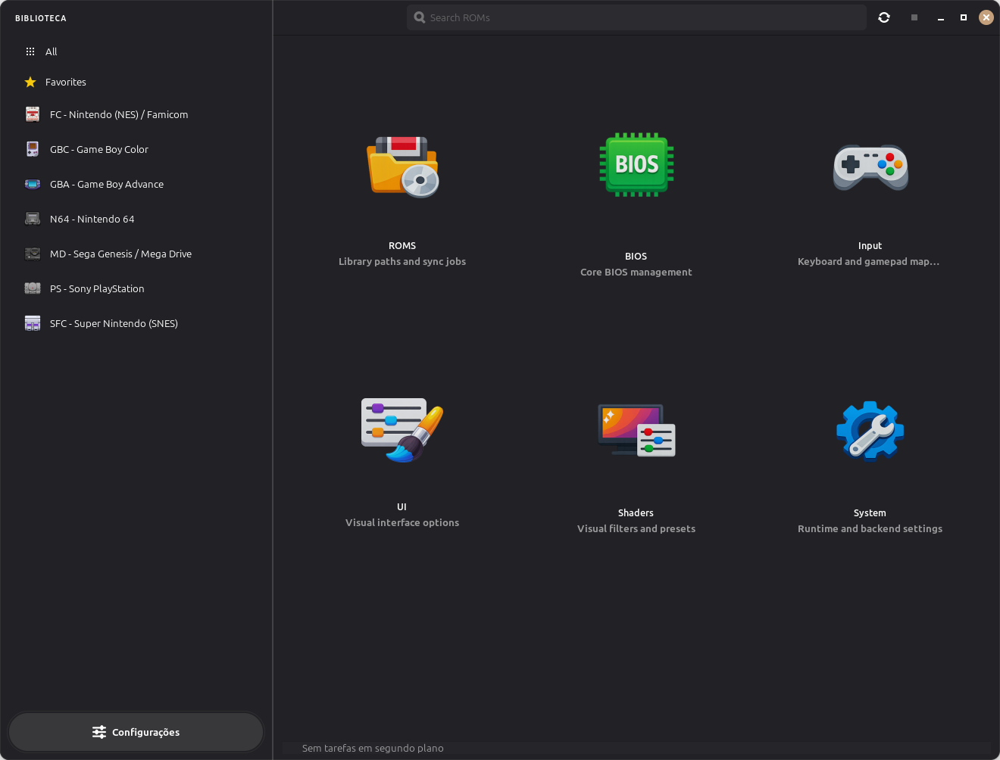
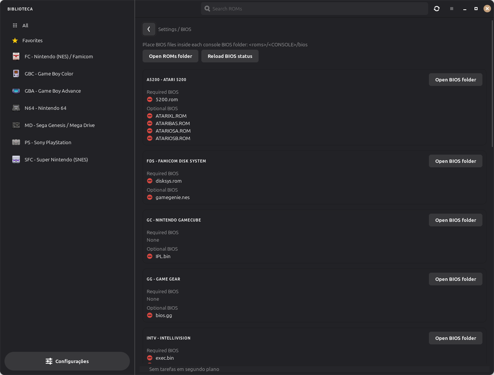
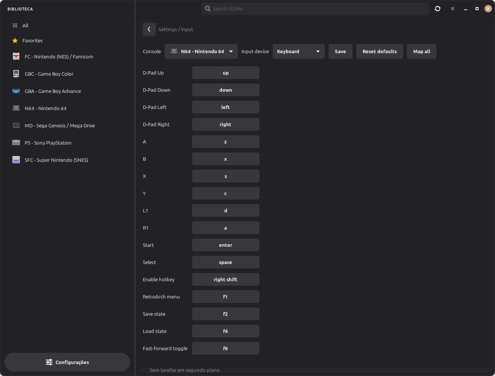

<p align="center">
  
</p>

<h1 align="center">OpenEmux</h1>

<p align="center">
  A beautiful, Linux-native emulation frontend that makes RetroArch simple and enjoyable for everyone.
</p>

<p align="center">
  <a href="https://guilhermefeitosa66.github.io/OpenEmux/">
    
  </a>
  &nbsp;
  <a href="https://github.com/guilhermefeitosa66/OpenEmux/releases/latest">
    
  </a>
  &nbsp;
  <a href="https://www.reddit.com/r/OpenEmux/">
    
  </a>
  &nbsp;
  <a href="https://github.com/guilhermefeitosa66/OpenEmux/blob/main/LICENSE">
    
  </a>
</p>

<p align="center">
  <a href="https://github.com/guilhermefeitosa66/OpenEmux/actions/workflows/tests.yml">
    
  </a>
  &nbsp;
  <a href="https://github.com/guilhermefeitosa66/OpenEmux/actions/workflows/security.yml">
    
  </a>
</p>

---

## About

[RetroArch](https://www.retroarch.com/) is one of the most powerful and versatile emulation platforms ever created — but its interface can be intimidating, especially for users who just want to pick up a controller and play. OpenEmux wraps RetroArch in a clean, intuitive frontend so you can enjoy your retro game library without touching a single config file.

OpenEmux was directly inspired by [OpenEmu](https://openemu.org/), the beloved macOS emulator that made retro gaming on Mac feel effortless and beautiful. Since OpenEmu is exclusive to macOS, I built OpenEmux to bring that same polished experience to Linux.

> This project would not be possible without the incredible work done by the [RetroArch](https://www.retroarch.com/) and [libretro](https://www.libretro.com/) teams, and the design philosophy of [OpenEmu](https://openemu.org/). Huge thanks to both projects. ❤️

---

## Play the Games You Own

> *"With OpenEmu, it is extremely easy to add, browse, organize and — with a compatible gamepad — play those favorite games (ROMs) you already own."* — the OpenEmu project

OpenEmux follows that same philosophy. It is a **front-end for RetroArch**, built to make emulation approachable and enjoyable — it is **not** a source of games. OpenEmux ships **no games, ROMs, or BIOS files**, and never will.

- **Use only content you legally own.** Dump your own cartridges and discs, or use backups of games you have purchased.
- **We do not support or condone piracy.** Downloading copyrighted games you don't own is against the law in most countries — and it isn't what this project is for.
- **Emulation preserves history.** So much of gaming's history lives on fragile, aging hardware and media. Emulation keeps that culture — the art, the music, the design — playable and studyable for the future. That preservation is legitimate and important, and it works best when it respects the people who created these games.

OpenEmux exists to give that legitimate, personal-library experience the polished, native Linux home it deserves.

---

## Download & Install

Grab the latest build from the [Releases page](https://github.com/guilhermefeitosa66/OpenEmux/releases/latest). Three formats are available — pick whichever suits your distro.

On first launch, OpenEmux automatically sets up its configuration directory, downloads the required libretro cores from the RetroArch Buildbot, and gets everything ready for you.

### AppImage (any distro)

```bash
chmod +x OpenEmux-x86_64.AppImage
./OpenEmux-x86_64.AppImage
```

> On systems without FUSE configured, use:
>
> ```bash
> APPIMAGE_EXTRACT_AND_RUN=1 ./OpenEmux-x86_64.AppImage
> ```

### Debian / Ubuntu (`.deb`)

Requires **Ubuntu 24.04 LTS or newer** (or a Debian release with libadwaita ≥ 1.5). `apt` pulls in the GTK4/Adwaita dependencies for you:

```bash
sudo apt install ./openemux_*_amd64.deb
```

### Fedora (`.rpm`)

Requires **Fedora 40 or newer** (libadwaita ≥ 1.5):

```bash
sudo dnf install ./openemux-*.x86_64.rpm
```

The `.deb` and `.rpm` install OpenEmux under `/opt/openemux` and add an `openemux` launcher plus a desktop entry, so it shows up in your application menu.

---

## Screenshots

### ROM Library

Browse your game collection with cover art, organized by console — just like a real game shelf.

<p align="center">
  
  &nbsp;
  
</p>
<p align="center">
  
  &nbsp;
  
</p>

### Gameplay

Launch any game directly from OpenEmux. RetroArch runs in the background, fully configured and ready to go.

<p align="center">
  
  &nbsp;
  
</p>

### Settings

A clean, sidebar-based settings panel lets you configure ROM paths, BIOS files, input mappings, and shaders — all without leaving the app.

<p align="center">
  
  &nbsp;
  
  &nbsp;
  
</p>

- **General / ROMs** — set your ROM directory, scan for new games, and sync cover art from the libretro thumbnail repository.
- **BIOS** — check which required BIOS files are present for each console (e.g. PS1, Saturn).
- **Input** — configure keyboard and gamepad mappings per console. Changes are applied at launch time via RetroArch's `--appendconfig`.

---

## Community

Join the OpenEmux community on Reddit at [r/OpenEmux](https://www.reddit.com/r/OpenEmux/) — share your setup, ask for help, report issues, and follow what's coming next.

---

## Support the Project

OpenEmux is free and open source. If you find it useful, consider buying me a coffee!

<p align="center">
  <a href="https://www.paypal.com/donate?business=BGCLFHKKB6XTU&no_recurring=0&item_name=Support+OpenEmux%3A+a+Linux+retro+gaming+frontend+inspired+by+OpenEmu.+Your+donation+helps+improve+features+and+stability.&currency_code=BRL" target="_blank">
    
  </a>
</p>

---

## Build from Source

If you want to hack on OpenEmux or build the packages yourself:

```bash
# Clone the repo
git clone https://github.com/guilhermefeitosa66/OpenEmux.git
cd OpenEmux

# Install system dependencies and set up the Python venv
make bootstrap

# Run the app in development mode
make run

# Run the test suite
make test

# Build the release artifacts (all require Docker)
make appimage   # universal AppImage
make deb        # Debian/Ubuntu package
make rpm        # Fedora package
make packages   # all three at once
```

> 📖 **Full [Developer Guide](docs/DEVELOPMENT.md)** — project layout, running
> from source on any distro, the test suite, and how each package is built and
> laid out.

---

## Running from Source (no build required)

If you just want to run OpenEmux from source without building the AppImage:

```bash
# Clone the repo
git clone https://github.com/guilhermefeitosa66/OpenEmux.git
cd OpenEmux

# 1. Install system dependencies (GTK4, Adwaita, PyGObject — requires sudo)
make install-sys-deps

# 2. Create the Python virtual environment
make venv

# 3. Install Python packages into the venv
make setup

# 4. Run the app
make run
```

> Steps 1–3 can be combined with `make bootstrap` (equivalent to `install-sys-deps + venv + setup`).

---

## License

OpenEmux is licensed under the **MIT License** — see the [LICENSE](LICENSE) file.

**Is MIT compatible with RetroArch being GPLv3?** Yes. OpenEmux does not include,
copy, or link any RetroArch code — it launches RetroArch as a **separate
external program**. The GPL's copyleft only extends to *derivative/combined*
works (linking or incorporating GPL code), not to programs that merely run
another program at arm's length, so OpenEmux's own code stays MIT. For reference,
RetroArch is [GPLv3](https://github.com/libretro/RetroArch) while the libretro
API itself is MIT.

When OpenEmux **bundles and redistributes** RetroArch (the vendored AppImage) or
downloads libretro cores, those components keep their own licenses (GPLv3 and
others) — a "mere aggregation" of independently-licensed software. See
[THIRD_PARTY_NOTICES.md](THIRD_PARTY_NOTICES.md) for details. *(Informational,
not legal advice.)*

---

<p align="center">
  Made with lots of love and care by <strong>Guilherme Feitoza</strong> &nbsp;🇧🇷<br/>
  <br/>
  I'd love to hear your feedback, ideas, and suggestions for improvement.<br/>
  Pull requests are very welcome — this is free software, and it grows with the community. 🙌
</p>
